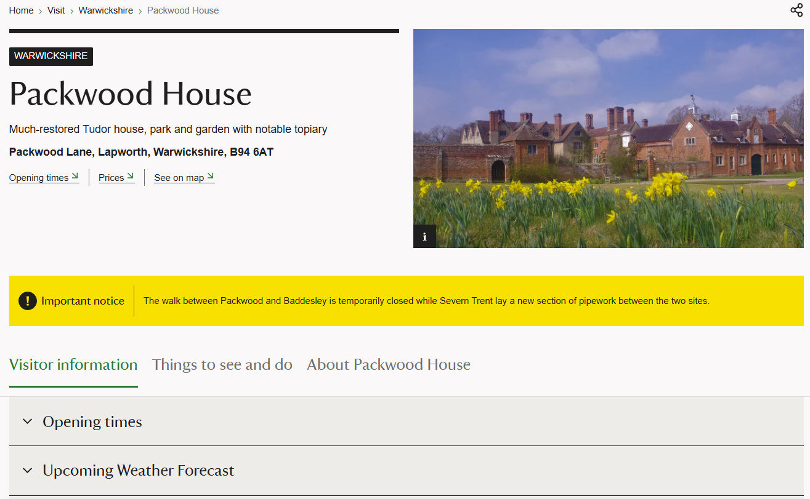
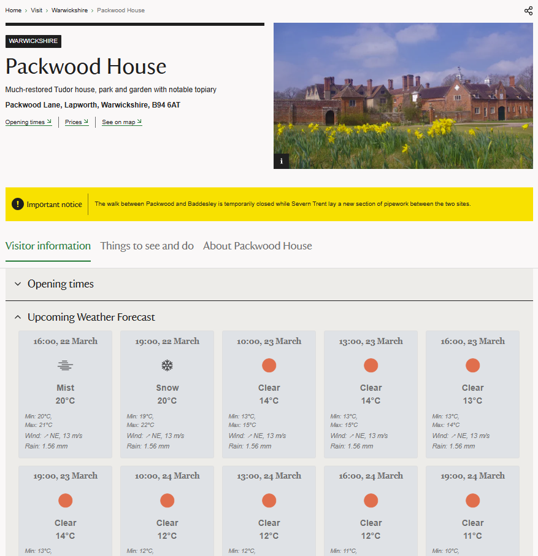

# Good Growth Technical Test - Sam Annetts Submission

#### Final solution found in collated_script.js, can be used through Google Snippets

## Process Explanation

For this challenge, we have been asked to write some code which will display the upcoming week's weather for any of National Trust's online listed properties. The aim for this was to increase the probability of the users visiting a property.

In order to build this functionality, I first had to find the location information of the property-of-interest from the webpage. For this, I looked through multiple property pages to research commonly available resources, and found each one had a 'Getting Here' section which had a Google Maps link inside. From this, I was able to extract the map's pinned location and isolate the latitude and longitude of the property.

Then, using an API endpoint given to us by Good Growth, I was given the weather information for the next 5 days for that location. For context, an API is a messenger that takes a request from one system, asks another system for information, and then brings the response back. In this scenario, the first system would be your computer or mobile phone and the second system would be a server or a database.

Having now received the weather information, I extracted the key information that I wanted to display and built the 'weather card' template that I wanted each time period's information shown in. To keep the style of my weather cards consistent with the aesthetic of the existing website, I chose to include this as a drop down menu in the 'Visitor Information' section. In my research, I noted that the exact contents of this section varied, but all pages included a 'Opening Times' section, so I added it below this heading for consistency across pages.

When deciding what information to display, I opted to only show weather between the hours of 08:00 and 19:00. I did this because I believe this window would capture the time window that the properties were open for, whilst not overloading the user with too much 'unnecessary' information.

Finally, I included a function that will allow AB testing to be used. For context, A/B testing is a method used to compare two versions of a webpage (Version A and Version B) by randomly showing each version to different users. By measuring user behavior—such as clicks or conversions, National Trust can determine which version performs better. In this scenario, upon first visit, my function will attach a cookie to the user, labelling them as Group A or Group B. Group A will be met with the default version of the website, where Group B will be able to view the version with my weather cards included.

### Note

My code attempts to copy the expand / collapse animation of the other drop down menus such as 'Opening Times'. Given limitations of testing on the browser, my script cannot access the existing Javascript animation code on the website, so I have created my own. Whilst this works, the arrow may appear misaligned upon first time opening. If this occurs, open another menu (e.g. Opening Times) and this should correct my Upcoming Weather Forecast section.

## Screenshots

### Closed Weather Information Section

### Open Weather Information Section

